<!-- README.md é gerado a partir de README.Rmd. Edite esse arquivo -->

# MIDR (& IICA) Modelos 

<!-- [](https://github.com/ rodrigoesborges/midrmodelos/actions/workflows/check-standard.yaml) -->

Este pacote R fornece R Markdown e **modelos Quarto** prontos para uso
para formatos de saída HTML, PDF e Microsoft Word, que são usados na
Coordenação-Geral de Gestão da Informação da Secretaria de
Desenvolvimento Regional do Ministério da Integração e Desenvolvimento
Regional. O pacote visa incentivar a pesquisa reprodutível usando a
sintaxe simples do Markdown enquanto incorpora todo o código R para
produzir gráficos, tabelas e análises também. Incluídos no pacote estão
modelos para

- esboços/análises preliminares internas
  - [R Markdown: documento PDF simples em português (padrão) ou inglês -
    `pdf_simple`](#r-markdown-documento-pdf-simples-em-português-padrão-ou-inglês---pdf_simple)
    
  - [Quarto: Formato de saída para um documento PDF simples em português
    (padrão) ou inglês -
    `pdf_simple`](#quarto-formato-de-saída-para-um-documento-pdf-simples-em-português-padrão-ou-inglês---pdf_simple)
    
- arquivos HTML do projeto
  - [R Markdown: documento HTML (design simples) -
    `html_simple`](#r-markdown-documento-html-design-simples---html_simple)
    
  - [R Markdown: documento HTML (com design de bootstrap ‘Material’) -
    `html_material`](#r-markdown-documento-html-com-design-de-bootstrap-material---html_material) -
    
  - [Quarto: formato de saída HTML simples -
    `html`](#quarto-formato-de-saída-html-simples---html) 
- Relatórios em PDF
  - \[R Markdown: relatório SDR em português (padrão) ou inglês -
    `pdf_report`\] - 
  - \[R Markdown: relatório/boletim SDR em português (padrão) ou
    inglês - `pdf_periódico`\] - 
  - [Quarto: Formato de saída para um relatório PDF em português
    (padrão) ou inglês -
    `pdf_report`](#quarto-formato-de-saída-para-um-relatório-pdf-em-português-padrão-ou-inglês---pdf_report) -
    
- folhas de dicas (cheatsheet)
  - [R Markdown: Formato de saída para uma folha de dicas simples
    (PDF) -
    `pdf_cheatsheet`](#r-markdown-formato-de-saída-para-uma-folha-de-dicas-simples-pdf---pdf_cheatsheet) -
    
- Documentos MS Word
  - [R Markdown: documento simples do Microsoft Word -
    `word_doc`](#r-markdown-documento-simples-do-microsoft-word---word_doc) -
    
  - [Quarto: formato de saída simples do Microsoft Word -
    `word`](#quarto-formato-de-saída-simples-do-microsoft-word---word) -
    
- conversões de documentos R Markdown para Jupyter Notebooks
  - [R Markdown: formato de saída do Jupyter Notebook -
    `rmd_to_jupyter`](#r-markdown-formato-de-saída-do-jupyter-notebook---rmd_to_jupyter) -
    

A fonte padrão para todos os modelos é ‘Lato’, mas a fonte pode ser
substituída pelo estilo de fonte ‘Helvetica’ nos modelos PDF e Word.A
maioria dos modelos inclui ainda a identidade visual da SDR e adotou seu
design, mas pode ser facilmente substituído no cabeçalho YAML e também o
estilo pode ser modificado, por exemplo, adicionando sua própria folha
de estilo CSS no cabeçalho YAML do modelo HTML. Portanto, esses modelos
não se limitam a servidores ou colaboradores da SDR.

Os templates foram desenvolvidos de uma adaptação livre daqueles
existentes no pacote UHHformats. **Para ajudar a começar, todos os
modelos já contêm alguns exemplos de texto e código** para formatar
texto, escrever equações, criar tabelas e figuras com referências
cruzadas e incluir referências.

**NOVO nesta versão**:

- Primeira adaptação livre - primeira versão de do format word e
  word_doc

## Instalação

Instale a versão de desenvolvimento do GitHub usando o pacote *remotes*:

``` r
if (!require("remotes")) install.packages("remotes")
remotes::install_github("rodrigoesborges/midrmodelos", build_vignettes = TRUE)
```

Certifique-se de que você também tenha as versões mais recentes dos
pacotes R *rmarkdown* e *knitr* instaladas. Para alguns modelos R
Markdown, você também precisa do pacote R *bookdown*.

``` r
if (!require("rmarkdown")) install.packages("rmarkdown")
if (!require("knitr")) install.packages("knitr")
if (!require("bookdown")) install.packages("bookdown")
```

Se você estiver mais interessado nos templates Quarto certifique-se de
ter o Quarto CLI instalado em sua máquina:
<https://quarto.org/docs/get-started/>. Para renderizar os documentos
.qmd diretamente do console você precisa ter o pacote Quarto R
instalado:

``` r
if (!require("quarto")) install.packages("quarto")
```

## Começando

### R Documentos de Markdown

#### Criando um novo documento e renderizando-o no R Studio

Depois de instalar o pacote, talvez seja necessário fechar e reabrir o
​​RStudio para ver os `midrmodelos` modelos listados.

1.  Escolha **Arquivo** \> **Novo arquivo** \> **R Markdown** e
    selecione **Do modelo**. Você deve ser capaz de criar um novo
    documento a partir de um dos modelos de pacote:

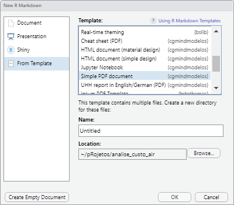

2.  Escolha o diretório no qual deseja salvar seu arquivo e forneça um
    nome de arquivo (esse nome será usado tanto para o arquivo .Rmd
    quanto para a nova pasta na qual o arquivo .Rmd será colocado).

3.  Se você estiver interessado na documentação já fornecida no arquivo
    de modelo para começar, renderize o documento uma vez antes de
    começar a alterar o conteúdo (clique no botão `Knit`).

#### Sem RStudio

Você pode criar um novo diretório dentro do seu diretório atual,
incluindo o arquivo R Markdown pronto para uso e todos os arquivos
associados (por exemplo, imagens, fontes, modelos LaTeX, etc.), com a
função interna `create_rmd_doc()`, que é adotado do pacote
[rmdformats](https://github.com/juba/rmdformats).

Utilize, por exemplo,

``` r
midrmodelos::create_rmd_doc(dirname = "new_doc", template = "pdf_report")
```

para gerar uma saída PDF semelhante a um relatório.

Alternativamente, use

``` r
rmarkdown::draft("new_doc.Rmd", template = "html_simple", package = "midrmodelos")
```

Essas funções criarão automaticamente o subdiretório e colocarão o
arquivo .Rmd gerado e todos os arquivos e pastas associados nele.

Você pode renderizar seu documento no formato de saída HTML, PDF ou Word
usando a função `render()` do pacote `rmarkdown`:

``` r
setwd("./new-doc")
rmarkdown::render("new-doc.Rmd")
```

**Nota importante**: `rmarkdown::render` usa como padrão o Pandoc para
converter o documento Markdown em HTML ou PDF. Enquanto o R Studio usa
sua instalação interna do Pandoc, caso trabalhe sem RStudio deverá ter o
Pandoc e seu analisador de citações também instalado em seu sistema.
Consulte <https://pandoc.org/installing.html> para obter instruções.
Este capítulo de livro também é útil:
<https://bookdown.org/yihui/rmarkdown-cookbook/install-pandoc.html>

### Documentos Quarto

No momento, os modelos Quarto não são suportados na IDE RStudio . Até
que isso mude, você pode acessar esses templates com a função
`create_quarto_doc()`. A função tem três argumentos: `dirname` para o
nome do subdiretório (e arquivo .qmd), `template` para os tipos de saída
(escolha entre ‘html’, ‘pdf_simple’, ‘pdf_report’ ou ‘word’) e `font`
para o tipo de fonte. Se o formato de saída for PDF ou Word, você pode
escolher entre a fonte ‘Helvetica’ e ‘TheSansSDR’. A função irá copiar
os arquivos .qmd e os arquivos e pastas associados para este novo
subdiretório

Utilize, por exemplo,

``` r
midrmodelos::create_qmd_doc(dirname = "my_html_doc", template = "html")
midrmodelos::create_qmd_doc(dirname = "my_pdf_doc", template = "pdf_simple", font = "TheSansSDR")
```

gerar uma página HTML com a fonte padrão do navegador ou um documento
PDF simples com a fonte da própria Universidade.

Se você estiver usando o RStudio, vá no gerenciador de arquivos para o
seu novo subdiretório, abra o arquivo .qmd e clique no botão **Render**.
Para saída HTML, você pode usar alternativamente a função
`quarto_render()` do pacote *quarto*:

``` r
setwd("./my_html_doc")
quarto::quarto_render("my_html_doc.qmd", output_format = "html")
```

### Requisitos adicionais - LaTeX

Além do Pandoc ou R Studio ser instalado, você precisa ter o
[LaTeX](https://www.latex-project.org/about/) instalado se quiser usar
os modelos que convertem R Markdown para formatos de saída PDF.
Dependendo de seus sistemas operacionais, existem diferentes
distribuições que você pode usar, por exemplo, veja aqui:
<https://www.latex-project.org/get/>

Uma maneira fácil de instalar o LaTeX em qualquer plataforma é com o
pacote [tinytex](https://yihui.org/tinytex/) R:

``` r
install.packages('tinytex')
tinytex::install_tinytex()
# Após reiniciar o R ​​Studio, confirme se você possui LaTeX com
tinytex:::is_tinytex()
```

TinyTeX é uma distribuição LaTeX personalizada baseada no TeX Live que é
pequena em tamanho, mas que inclui as funções mais relevantes (para
usuários de R). Você pode, no entanto, ainda precisar instalar alguns
pacotes LaTeX extras em sua primeira tentativa de tricotar ao usar este
pacote.

Embora o LaTeX seja uma ferramenta poderosa e popular na Academia, pode
demorar um pouco para aprender a sintaxe e encontrar a formatação
correta. R Markdown e o modelo PDF nestes pacotes oferecem uma sintaxe
muito mais simples e a incorporação direta de figuras e tabelas, mas ao
custo de perder um pouco da expressividade do LaTeX. No entanto, você
pode inserir o código LaTeX diretamente nos arquivos R Markdown e também
adicionar pacotes LaTeX e estilos de formato no cabeçalho YAML.

Se você quiser saber mais sobre o LaTeX, um bom começo é o tutorial
*overleaf* (e toda a sua documentação):
<https://www.overleaf.com/learn/latex/Learn_LaTeX_in_30_minutes>

------------------------------------------------------------------------

## Galeria de modelos de Markdown R

### R Markdown: documento HTML (design simples) - `html_simple`

→ para um arquivo de exemplo veja também
[aqui](https://github.com/rodrigoesborges/midrmodelos/blob/master/resources/examples/demo_rmd_html_simple.html).

Este modelo converte o arquivo R Markdown em um arquivo HTML simples com
uma tabela de conteúdo fixa no canto superior direito e um botão de
dobra de código semelhante aos blocos de anotações R, o que é útil nas
tarefas dos alunos.

Sua função chama internamente `rmarkdown::html_document` ou
`bookdown::html_document2`. Este último é o padrão, portanto, a seção
numerada (definida como `FALSE` como padrão) e a numeração automática de
figuras e tabelas é suportada. No entanto, observe que o hiperlink na
referência cruzada ainda não funciona neste modelo. A base para esta
função e o código HTML, CSS e JavaScript é o template `html_clean`
desenvolvido por Julien Barnier no pacote
[rmdformats](https://github.com/juba/rmdformats).

O modelo R Markdown atual tem no cabeçalho YAML:

    ---
    title: "Título"
    author: "nome do autor"
    date: "2024-09-03"
    output:
      midrmodelos::html_simple:
        highlight: kate
        code_folding: mostrar
        use_bookdown: true
        number_sections: false
    editor_options:
      chunk_output_type: console
    ---

Para obter uma visão geral das opções que podem ser definidas no
cabeçalho YAML além de `highlight`, `code_folding` e `number_sections`
veja o arquivo de ajuda para `html_simple` bem como
`bookdown::html_document2` ou `rmarkdown::html_document` .

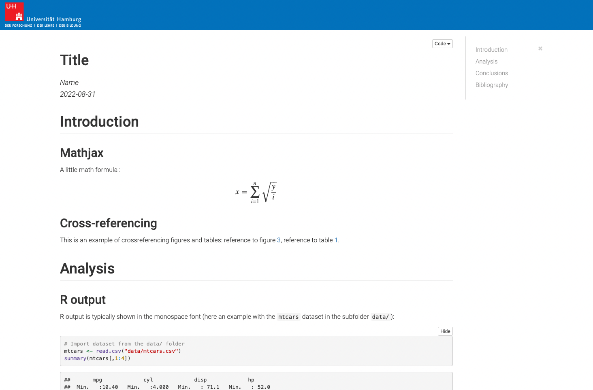

### R Markdown: documento HTML (com design de bootstrap ‘Material’) - `html_material`

→ para um arquivo de exemplo veja também
[aqui](https://github.com/rodrigoesborges/midrmodelos/blob/master/resources/examples/demo_rmd_html_material.html).

Este modelo converte o arquivo R Markdown em um arquivo de saída HTML
que possui uma barra de navegação à esquerda e na qual as diferentes
seções (definidas pela configuração do nível de cabeçalho 1 (#)) são
exibidas em páginas ou cartões individuais. Se você quiser todas as
seções em uma única página, adicione a opção `cards: false` no cabeçalho
YAML. O design é uma adaptação do tema Material design para o projeto
Bootstrap 3: <https://github.com/FezVrasta/bootstrap-material-design>.
Também neste modelo, o código HTML, JavaScript, CSS e R foram
originalmente desenvolvidos por Julien Barnier no pacote
[rmdformats](https://github.com/juba/rmdformats) e apenas ligeiramente
modificados aqui para adaptá-lo ao *Programa de Ciência de Dados em
Biologia* do SDR.

Semelhante a `html_simple`, a função subjacente chama internamente
`rmarkdown::html_document` ou (padrão) `bookdown::html_document2`. Mas
aqui, a seção numerada é definida como `TRUE` como padrão e também o
hiperlink nas referências cruzadas funciona. Para obter uma visão geral
das opções que podem ser definidas no cabeçalho YAML além de `highlight`
e `code_folding`, que são mostrados como exemplos no modelo R Markdown,
consulte o arquivo de ajuda para `html_material` bem como
`bookdown::html_document2` ou `rmarkdown::html_document`.

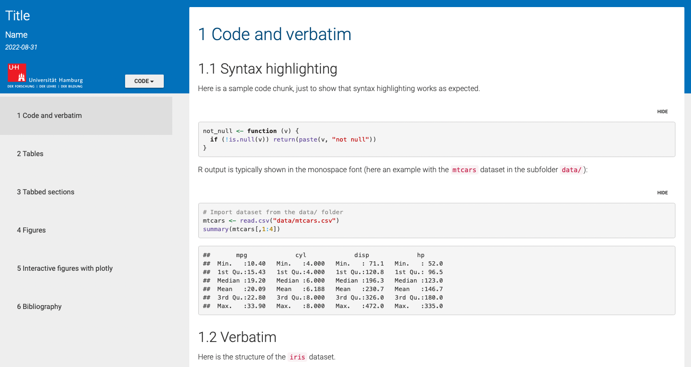

#### Recursos adicionais disponíveis nestes modelos HTML:

Alguns recursos extras foram adotados do
[rmdformats](https://github.com/juba/rmdformats) pacote, ou seja

- os conjuntos de guias são suportados como no modelo padrão feito com
  `rmarkdown::html_document()`
- ambos os modelos fornecem miniaturas automáticas para figuras com
  exibição em lightbox

### R Markdown: Documento simples do Microsoft Word - `word_doc`

→ para um arquivo de exemplo, veja também
[aqui](https://github.com/rodrigoesborges/midrmodelos/blob/master/resources/examples/demo_rmd_word_doc.docx).

Este modelo converte o arquivo R Markdown em um documento do Microsoft
Word, adequado para tarefas de alunos ou relatórios de projetos. A
função subjacente `word_doc` é um wrapper de `bookdown::word_document2`.
Usando internamente o *bookdown*, as configurações de idioma para
legendas de figuras e legendas de tabelas podem ser alteradas
automaticamente de inglês para alemão (ou qualquer outro idioma).

No cabeçalho YAML do modelo R Markdown, você pode personalizar
facilmente o idioma, a fonte, o estilo de bibliografia ou incluir um
índice e o título do mesmo. Por padrão, o `word_doc` usa um arquivo de
modelo ‘SDR-template’, que é baseado no [arquivo de modelo
padrão](https://www.kus.uni-hamburg.de/themen/oeffentlichkeitsarbeit/corporate-design/vorlagen.%20html)
da Universidade de Hamburgo (SDR), exceto pelo tipo de fonte, que é
definido como ‘Helvetica’. Se você estiver associado à SDR, também
poderá usar a fonte própria da Universidade “TheSansSDR”. Nesse caso,
substitua *font = “Helvetica”* por *font = “TheSansSDR”*.

Se você quiser usar seu próprio modelo ou o modelo padrão do Word (ou
seja, o arquivo Normal.dot), simplesmente forneça o caminho para seu
arquivo ou escreva “default” para o último caso (*reference_docx:
“default”*). Você também pode usar outra fonte usando a configuração
*font = “other”* e substituindo o ‘font_XXX.ttf’ no diretório de
trabalho com seus próprios arquivos. Observe que você deve nomear esses
arquivos exatamente como os arquivos de fonte do modelo.

Se você definir o idioma para alemão, um arquivo de configuração chamado
’\_bookdown.yml’ será copiado para o diretório de trabalho, que define
os rótulos da legenda da figura e das legendas da tabela. Se você quiser
usar outros rótulos (por exemplo, ‘Abb.’ em vez de ‘Abbildung’),
sinta-se à vontade para modificar o arquivo.

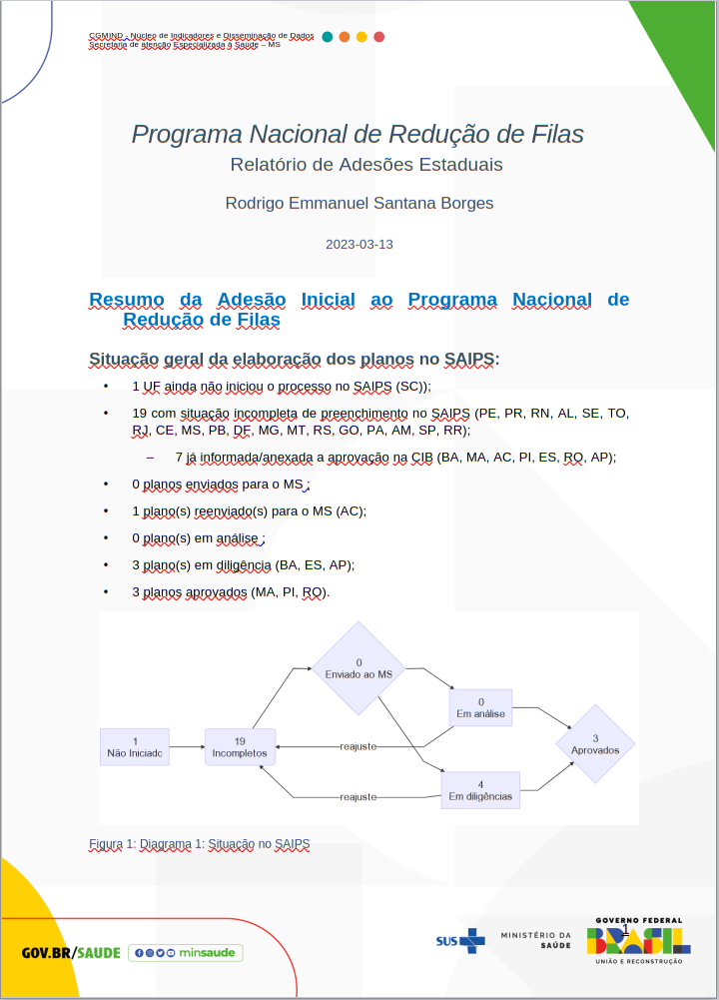

### R Markdown: Documento PDF simples em português (padrão) ou inglês - `pdf_simple`

→ para um arquivo de exemplo, veja também
[aqui](https://github.com/rodrigoesborges/midrmodelos/blob/master/resources/examples/demo_rmd_pdf_simple.pdf).

Este modelo converte o arquivo R Markdown em um documento simples
baseado em PDF/LaTeX estruturado como um artigo, que é adequado para
tarefas de alunos. A função subjacente `pdf_simple` é um wrapper de
`rmarkdown::pdf_document`. Semelhante ao modelo `pdf_report`, o
cabeçalho YAML oferece várias opções para ajustar o layout do documento.

No cabeçalho YAML do modelo R Markdown, você pode personalizar
facilmente os logotipos e a imagem da capa, o idioma, o estilo da
bibliografia ou até mesmo adicionar seu próprio estilo LaTeX com a opção
`include-after`:

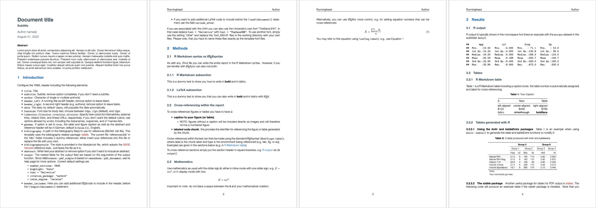

### R Markdown: relatório simples SDR em português (padrão) ou inglês - `pdf_report`

→ para um arquivo de exemplo, veja também
[aqui](https://github.com/rodrigoesborges/midrmodelos/blob/master/resources/examples/demo_rmd_pdf_report.pdf).

Este modelo converte o arquivo R Markdown em um relatório baseado em
PDF/LaTeX adequado para relatórios de projetos e tarefas de alunos. A
função subjacente `pdf_report` é um wrapper de `rmarkdown::pdf_document`
e baseado no pacote [rticles](https://github.com/rstudio/rticles) que
fornece modelos para vários artigos de periódicos. O modelo Pandoc LaTeX
e o layout do relatório são inspirados no pacote
[ireports](https://github.com/INWTlab/ireports) do INWTlab.

No cabeçalho YAML do modelo R Markdown, você pode personalizar
facilmente os logotipos e a imagem da capa, o idioma, o estilo da
bibliografia ou até mesmo adicionar seu próprio estilo LaTeX com a opção
`include-after`:

    ---
    title: "Título do documento"
    author: "Nome(s) do autor"
    date: \today
    font-size: 11pt
    german: false
    bibliography: bibfile.bib
    bibliografiastyle: bibstyle.bst
    parameters:
      cover: imagens/capa.png
      title_logo_left: images/SDR_logo.png
      title_logo_right: images/min_logo.png
      logo_small: imagens/logo_icon.png
    output:
      midrmodelos::pdf_report:
        df_print: kable
    ---

Para mais detalhes sobre os argumentos disponíveis em `pdf_report` (além
de `df_print` como mostrado aqui) veja seu arquivo de ajuda, bem como a
ajuda para `rmarkdown::pdf_document`.

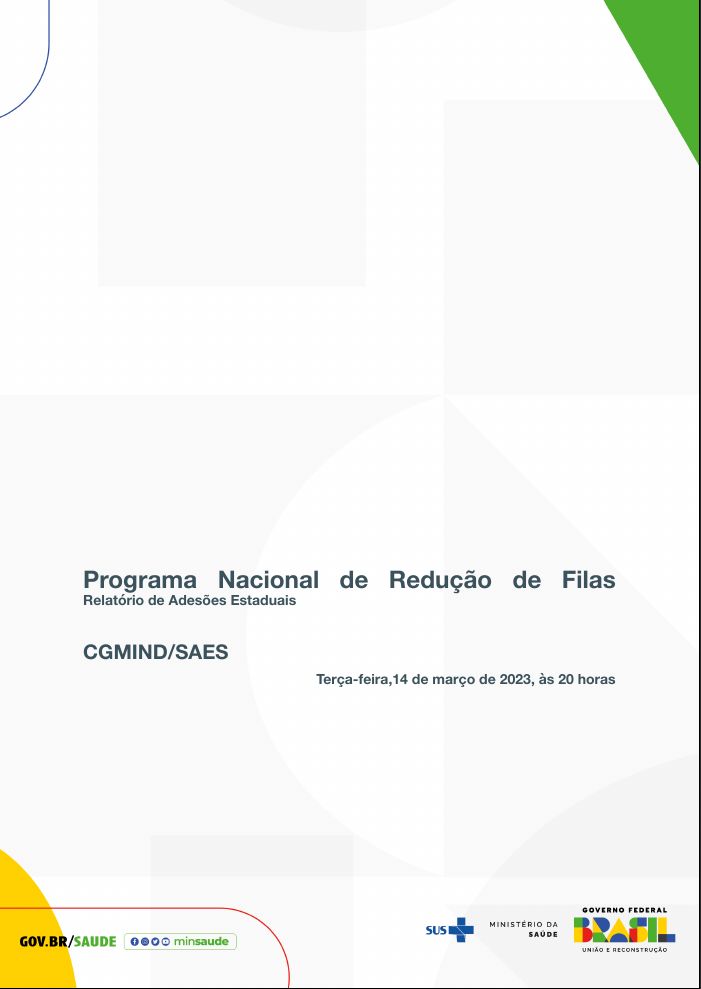

### R Markdown: boletim ou relatório periódico SDR em português (padrão) ou inglês - `pdf_periodic`

→ para um arquivo de exemplo, veja também
[aqui](https://github.com/rodrigoesborges/midrmodelos/blob/master/resources/examples/demo_rmd_pdf_periodic.pdf).

Este modelo converte o arquivo R Markdown em um relatório baseado em
PDF/LaTeX adequado para relatórios de projetos e tarefas de alunos. A
função subjacente `pdf_periodic` é um wrapper de
`rmarkdown::pdf_document` e baseado no pacote
[rticles](https://github.com/rstudio/rticles) que fornece modelos para
vários artigos de periódicos. O modelo Pandoc LaTeX e o layout do
relatório são inspirados no pacote
[ireports](https://github.com/INWTlab/ireports) do INWTlab.

No cabeçalho YAML do modelo R Markdown, você pode personalizar
facilmente os logotipos e a imagem da capa, o idioma, o estilo da
bibliografia ou até mesmo adicionar seu próprio estilo LaTeX com a opção
`include-after`:

    ---
    title: "Título do documento"
    author: "Nome(s) do autor"
    date: \today
    font-size: 11pt
    german: false
    bibliography: bibfile.bib
    bibliografiastyle: bibstyle.bst
    parameters:
      cover: imagens/capa.png
      title_logo_left: images/SDR_logo.png
      title_logo_right: images/min_logo.png
      logo_small: imagens/logo_icon.png
    output:
      midrmodelos::pdf_periodic:
        df_print: kable
    ---

Para mais detalhes sobre os argumentos disponíveis em `pdf_periodic`
(além de `df_print` como mostrado aqui) veja seu arquivo de ajuda, bem
como a ajuda para `rmarkdown::pdf_document`.

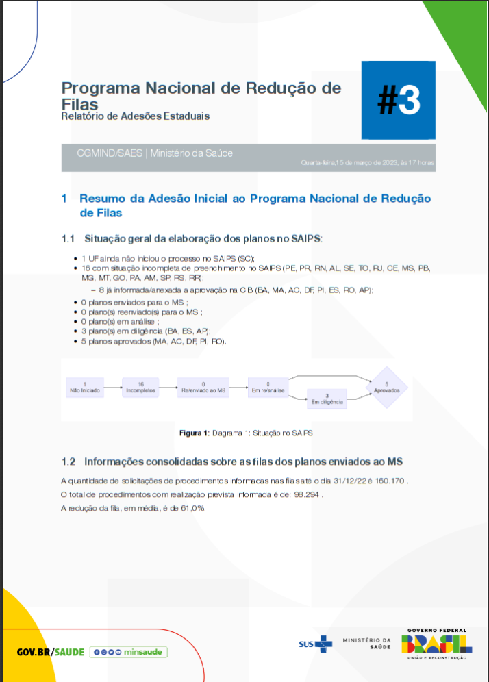

### R Markdown: Formato de saída para uma folha de dicas simples (PDF) - `pdf_cheatsheet`

→ para um arquivo de exemplo, veja também
[aqui](https://github.com/rodrigoesborges/midrmodelos/blob/master/resources/examples/demo_rmd_pdf_cheatsheet.pdf).

Modelo para criar uma folha de dicas simples. O formato de saída PDF
será de tamanho A4 e horizontal. Você pode definir se a folha de dicas
deve ter 2,3,4 ou mais colunas. Também o texto e a caixa cores e tamanho
da fonte podem ser ajustados. O [modelo LaTeX de Sarah
Lang](https://www.overleaf.com/latex/templates/colourful-cheatsheet-template/qdsshbjktndd)
serviu aqui como inspiração para o layout e o código.

Os modelos incluem comandos LaTeX predefinidos para caixas de texto. Se
você quiser usá-los para tornar sua folha de dicas visualmente mais
atraente, você precisa continuar codificando em LaTeX, infelizmente. Eu
ainda não consegui contornar o LaTeX em geral. No entanto, o arquivo de
modelo .Rmd fornece vários exemplos sobre o layout e a sintaxe do LaTeX,
o que esperamos que seja suficiente para o codificador inexperiente.

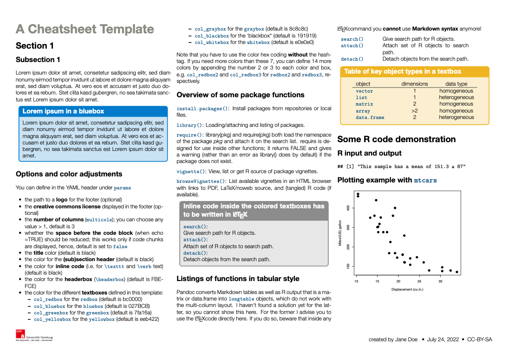

### R Markdown: formato de saída do Jupyter Notebook - `rmd_to_jupyter`

→ para um arquivo de exemplo, veja também
[aqui](https://github.com/rodrigoesborges/midrmodelos/blob/master/resources/examples/demo_rmd_to_jupyter.ipynb).

Embora eu seja um forte defensor do R Studio e do servidor R Studio como
IDE para R, há momentos em que \[Juypter
Notebook\]\[<https://jupyter.org/>\] é claramente a melhor opção. Não
apenas o Jupyter Notebooks permite executar o R ​​diretamente no navegador
sem a instalação de programas adicionais ao usar um servidor Notebook
remoto - na verdade, é para isso que o R Studio Server também serve -
mas os alunos podem usá-lo em qualquer dispositivo móvel, incluindo
smartphones. Isto é particularmente útil durante as palestras, quando
para envolver mais os alunos.

Então, eu estava procurando abordagens simples para converter meus
arquivos R Markdown em Jupyter Notebooks. Embora eu tenha encontrado
alguns pacotes como
[markdowntemplates](https://github.com/hrbrmstr/markdowntemplates) ou
[notedown](https://github.com/aaren/notedown) (dos quais o primeiro
depende) eu encontrei algumas questões:

- você precisa ter o Python e o notedown instalados e configurados
  corretamente antes de começar
- ao abrir os notebooks no Jupyter Notebook localmente ou usando um
  servidor remoto, não ou o kernel Phyton foi iniciado automaticamente,
  pois todos os pedaços de código foram lidos como código Python
- ao escolher o kernel R para o notebook, o sinalizador `%%R` aparecia
  em cada pedaço de código e precisava ser removido manualmente

Então, eventualmente, encontrei uma abordagem mais simples no pacote
[rmd2jupyter](https://github.com/mkearney/rmd2jupyter) desenvolvi meu
Michael Kearney e converti sua função em um modelo R Markdown aqui. A
função subjacente é uma função de malha personalizada, que converte o
código R Markdown diretamente em uma string JSON embelezada usando
`jsonlite::toJSON` e `jsonlite::prettify` e salva em um arquivo `.ipynb`

A única coisa que você precisa no cabeçalho YAML é, portanto:

    ---
    tricotar: midrmodelos::rmd_to_jupyter
    ---

Como tudo do cabeçalho YAML será cortado ao converter o código, qualquer
título, nome do autor ou outro campo será negligenciado.

Ao selecionar o modelo *Jupyter Notebook* no R Studio, um diretório
incluindo o arquivo `.Rmd` e a subpasta `images/` serão criados. Abra o
arquivo R Markdown e altere-o como quiser. Assim que você pressionar o
botão *knit* você deverá ver uma linha dizendo que o arquivo `.ipynb`
foi salvo. E pronto!

Ao abrir seu arquivo no Jupyter Notebook, observe que

- se você usar uma instalação local do Jupyter Notebook, o programa terá
  acesso automaticamente a todos os subdiretórios aos quais seu arquivo
  está vinculado (por exemplo, a pasta `images/` ou qualquer pasta
  `data/`)
- se você usa o servidor Jupyter Notebook, você precisa enviar o arquivo
  `.ipynb`, bem como todos os subdiretórios juntos como um arquivo zip.
  Para descompactar, basta abrir um novo notebook R e escrever na
  primeira célula: `unzip("zip_file_name.zip")`.

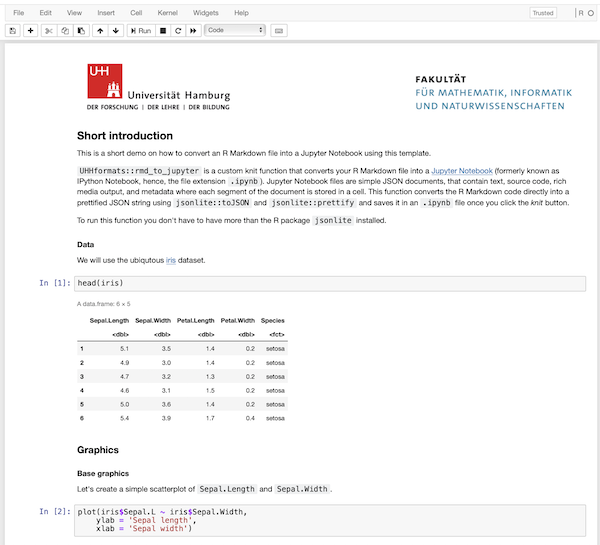

------------------------------------------------------------------------

## Galeria de modelos do Quarto

### Quarto: Formato de saída HTML simples - `html`

→ para um arquivo de exemplo veja também
[aqui](https://github.com/rodrigoesborges/midrmodelos/blob/master/resources/examples/demo_quarto_html.html).

Este modelo converte o arquivo Quarto em um arquivo HTML simples com uma
barra de navegação fixa no lado esquerdo, incluindo o logotipo SDR. Para
criar um subdiretório incluindo o tipo de arquivo de modelo Quarto no
console

``` r
midrmodelos::create_quarto_doc(dirname = "choose_a_name", template = "html")
```

Muitas das opções Quarto para saída HTML estão listadas no cabeçalho
YAML. Se você quiser saber mais sobre essas configurações, recomendo a
[referência do formato
HTML](https://quarto.org/docs/reference/formats/html.html) para obter
uma lista completa das opções disponíveis.

Um bom recurso do Quarto é sua extensa inteligência YAML (conclusão e
diagnóstico) no RStudio IDE e no VS Code para arquivos de projeto,
matéria frontal YAML e opções de células executáveis. Basta começar com
algumas letras e pressionar a tecla tab no teclado. Você verá uma
pequena caixa de diálogo com uma lista de opções disponíveis.

O modelo já contém texto de demonstração, que o ajudará, por exemplo,
escrevendo equações, layout de imagens e tabelas, referências cruzadas e
adição de citações em Quarto. Se precisar de mais ajuda, acesse a
documentação HTML da Quarto:
[https://quarto.org/docs/output-formats/html-basics.html](https://quarto.org/docs/output-formats/html-%20basics.html).

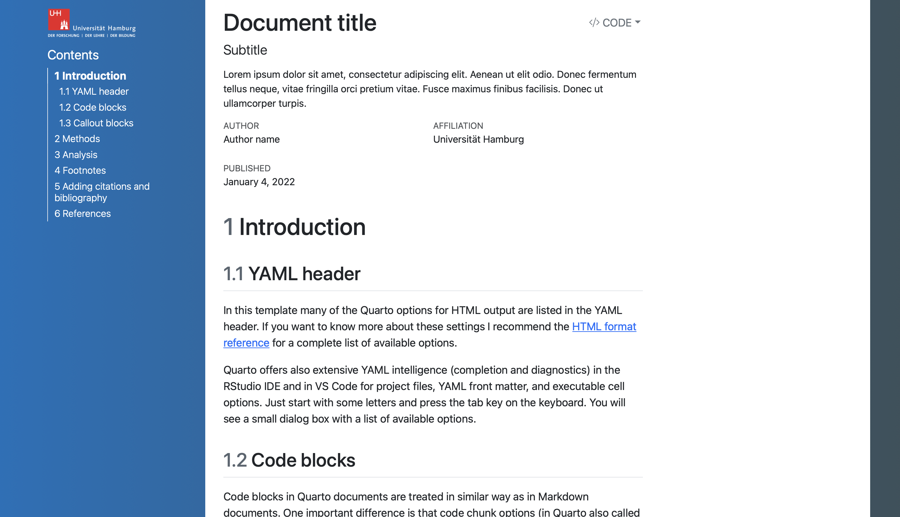

### Quarto: Formato de saída simples do Microsoft Word - `word`

→ para um arquivo de exemplo veja também
[aqui](https://github.com/rodrigoesborges/midrmodelos/blob/master/resources/examples/demo_quarto_word.docx).

Semelhante ao modelo `word_doc` do R Markdown, este modelo Quarto usa um
arquivo do Word ‘SDR-template.docx’, que é baseado no [arquivo de modelo
padrão](https://www.kus.uni-hamburg.de/%20themen/oeffentlichkeitsarbeit/corporate-design/vorlagen.html)
da Universidade de Hamburgo (SDR), exceto para o tipo de fonte, que é
por padrão ‘Helvetica’. Você pode escolher a fonte no modelo digitando
no console

``` r
midrmodelos::create_qmd_doc(dirname = "escolha-um-nome",
  template = "palavra", font = "TheSansSDR")
```

Mais informações são fornecidas no arquivo .qmd. Se precisar de ajuda
adicional, acesse a documentação do MS Word da Quarto:
[https://quarto.org/docs/output-formats/ms-word.html](https://quarto.org/docs/output-formats/ms%20-word.html)
Se você quiser usar seu próprio modelo ou o modelo padrão do Word (ou
seja, o Normal.dot file), simplesmente forneça o caminho para o seu
arquivo em `reference-doc:` ou comente/exclua esta linha,
respectivamente.

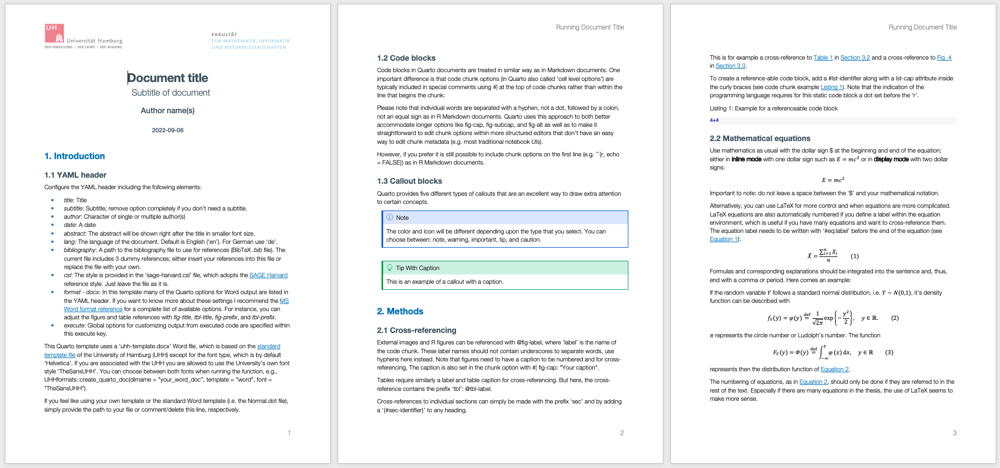

### Quarto: Formato de saída para um documento PDF simples em português (padrão) ou inglês - `pdf_simple`

→ para um arquivo de exemplo, veja também
[aqui](https://github.com/rodrigoesborges/midrmodelos/blob/master/resources/examples/demo_quarto_pdf_simple.pdf).

Este modelo converte o arquivo Quarto em um documento simples baseado em
PDF/LaTeX com um design semelhante ao modelo R Markdown `pdf_simple`.
Você pode escolher aqui entre dois tipos de fonte: ‘Helvetica’ (padrão)
e a própria fonte da Universidade ‘TheSansSDR’. Para criar um
subdiretório incluindo o arquivo de modelo Quarto, digite no console

``` r
midrmodelos::create_quarto_doc(dirname = "escolha-um-nome",
  template = "pdf_simple", font = "Helvetica")
```

Mais informações são fornecidas no arquivo .qmd. Se precisar de ajuda
adicional, acesse a documentação em PDF do Quarto:
[https://quarto.org/docs/output-formats/pdf-basics.html](https://quarto.org/docs/output-formats/pdf-%20basics.html).

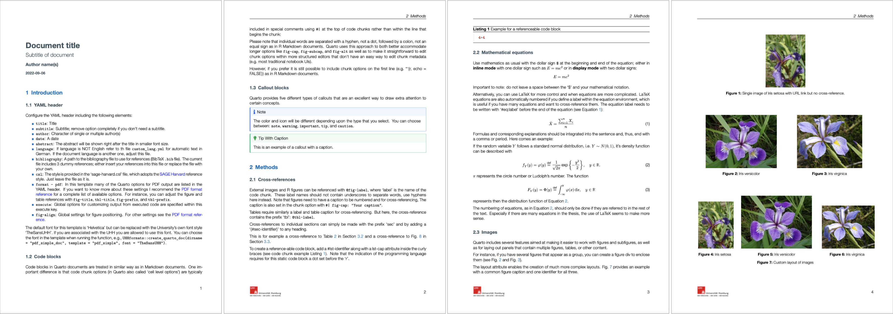

### Quarto: Formato de saída para um relatório PDF em português (padrão) ou inglês - `pdf_report`

→ para um arquivo de exemplo, veja também
[aqui](https://github.com/rodrigoesborges/midrmodelos/blob/master/resources/examples/demo_quarto_pdf_report.pdf).

Se você deseja ter mais um documento de estilo de relatório, escolha
como modelo ‘pdf_report’:

``` r
midrmodelos::create_quarto_doc(dirname = "escolha-um-nome",
  template = "pdf_report", font = "Helvetica")
```

O estilo deste modelo é semelhante ao modelo do R Markdown `pdf_report`,
exceto para a página de rosto e a página de título. A página de capa
pode ser ajustada usando uma imagem de capa diferente e cor de fundo e
de texto. Além disso, os logotipos da universidade na página de título
podem ser substituídos por seus próprios logotipos.

Mais informações são fornecidas no arquivo .qmd. Se precisar de ajuda
adicional, acesse a documentação em PDF do Quarto:
[https://quarto.org/docs/output-formats/pdf-basics.html](https://quarto.org/docs/output-formats/pdf-%20basics.html).

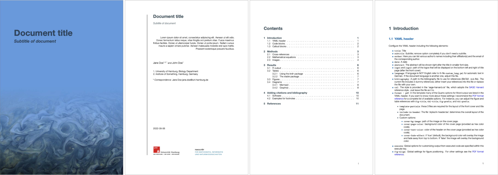

------------------------------------------------------------------------

## Recursos úteis

- R Markdown
  - A [documentação oficial do R
    Markdown](https://rmarkdown.rstudio.com/lesson-1.html) do RStudio
  - R Markdown [guia de
    referência](https://www.rstudio.com/wp-content/uploads/2015/03/rmarkdown-reference.pdf)
  - R Markdown
    [cheatsheet](https://github.com/rstudio/cheatsheets/raw/master/rmarkdown-2.0.pdf)
  - O livro online [R Markdown: The Definitive
    Guide](https://bookdown.org/yihui/rmarkdown/) de Yihui Xie, J. J.
    Allaire e Garrett Grolemund
- Quarto
  - O [guia oficial do Quarto](https://quarto.org/docs/guide/)
  - \[Galeria\] do Quarto(<https://quarto.org/docs/gallery/>)
- LaTeX
  - A [ajuda e documentação oficial do
    LaTeX](https://www.latex-project.org/help/documentation/)
  - A documentação [overleaf](https://www.overleaf.com/learn)
- W3Schools Online Web Tutorial para
  [HTML](https://www.w3schools.com/html/default.asp) e para
  [CSS](https://www.w3schools.com/css/default.asp).

## Créditos

1.  Pacote [UHHformats](https://github.com/saskiaotto/UHHformats) de
    Saskia Otto
2.  Créditos derivados:

- Pacote [rmdformats](https://github.com/juba/rmdformats) de Julien
  Barnier
- O pacote [rticles](https://github.com/rstudio/rticles)
- Pacote [ireports](https://github.com/INWTlab/ireports) do INWTlab
- Pacote [rmd2jupyter](https://github.com/mkearney/rmd2jupyter) de
  Michael Kearney
- \[modelo LaTeX para uma folha de dicas\] de Sarah Lang
  (<https://www.overleaf.com/latex/templates/colourful-cheatsheet-template/qdsshbjktndd>)
- Eli Holmes [coleção de modelos de páginas de título de
  quarto](https://nmfs-opensci.github.io/quarto_titlepages/) para o
  modelo Quarto mais recente para gerar saída de relatório em PDF.
